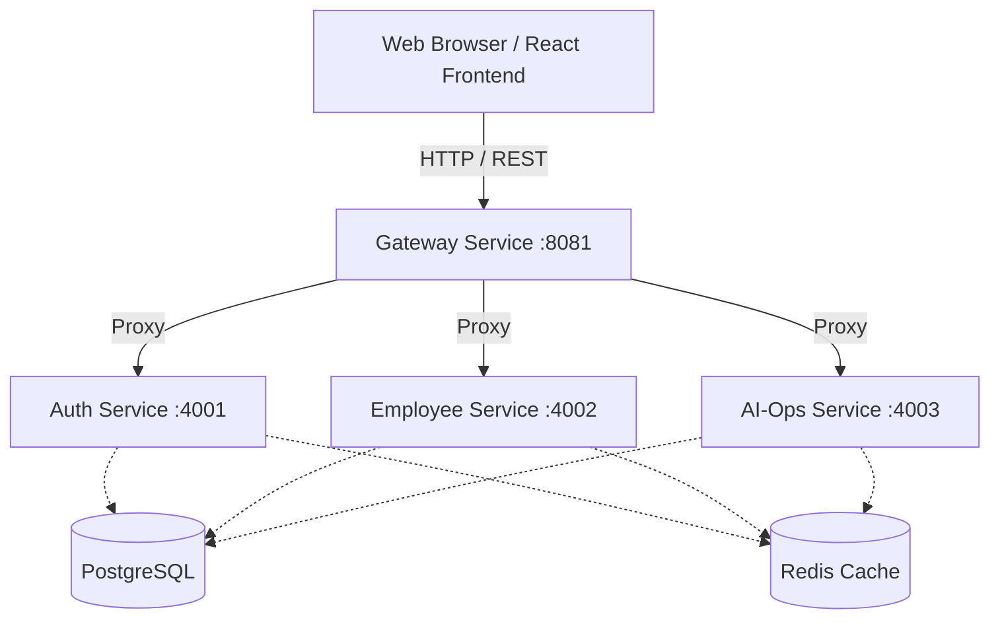

# Cloud Native AI HRMS Platform - Architecture

## High-Level Architecture

The platform uses a microservices architecture to ensure high availability, fault tolerance, and independent scaling of different business domains.

## Service Communication Flow

1. **Frontend to Gateway:** The React single-page application (SPA) communicates securely with the `gateway-service` acting as the API Gateway. All frontend requests share the `http://localhost:8081` base URL.
2. **Gateway to Microservices:** The `gateway-service` uses `http-proxy-middleware` to evaluate route paths (e.g., `/api/auth`) and forwards requests internally within the Docker network to the correct domain service (e.g., `auth-service`).
3. **Microservices to Databases:** The backend services communicate with internal storage components like `PostgreSQL` (port `5432`) and `Redis` (port `6379`).

## Docker Architecture

All services are orchestrated using `docker-compose`. 

- **Internal DNS:** Docker handles internal DNS mapping, meaning `gateway-service` can proxy to `http://auth-service:4001` without exposing the internal microservices to the host.
- **Frontend Container:** Served via an Nginx container. `nginx:alpine` listens on port `3000` inside the container and relies on a `try_files` fallback rule to seamlessly handle React Router history navigation.

## Microservices Breakdown

- **Gateway Service (Node.js/Express):** Proxies routes, provides centralized CORS configuration, and functions as the singular ingress controller for local environments.
- **Auth Service (Node.js/Express):** Handles JWT generation and user credential validation (currently mocked).
- **Employee Service (Node.js/Express):** Handles CRUD operations for the employee directory.
- **AI-Ops Service (Node.js/Express):** Integrates AI capabilities to analyze system logs, candidate resumes, and active incidents. 
